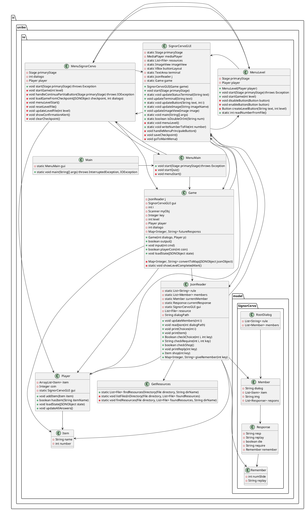
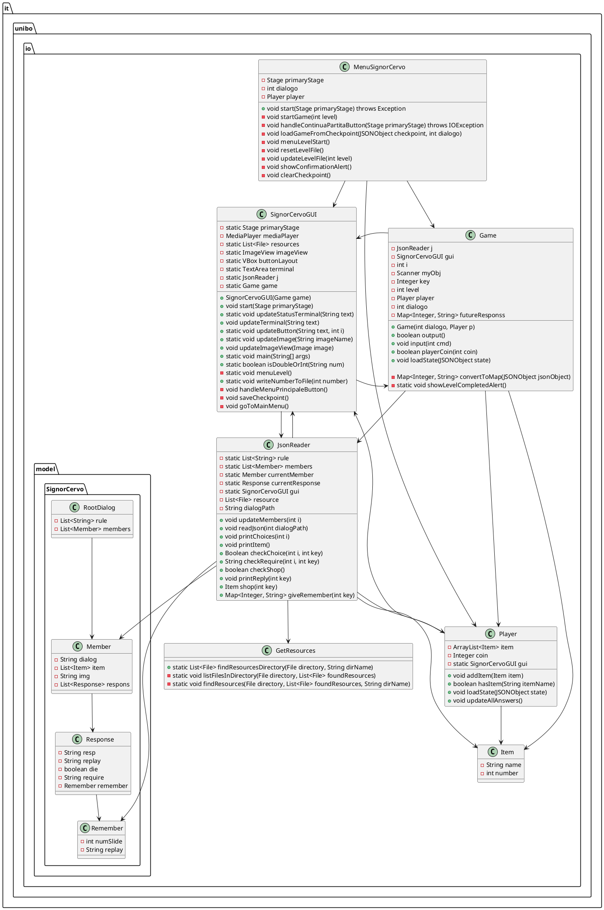

# Progetto "Progettazione e Sviluppo del Software"

## Descrizione Generale del Progetto

Il progetto prevede lo sviluppo di un software che presenta una schermata iniziale in cui l'utente può scegliere tra due opzioni:

- Avviare il gioco principale: **Signor Cervo**
- Partecipare al minigioco: **Quiz**

L'utente può selezionare il gioco tramite due pulsanti presenti nella schermata principale.

## Descrizione Generale di "Signor Cervo"

"Signor Cervo" è un gioco interattivo basato su una storia a scelte multiple. Il giocatore deve prendere decisioni per proseguire, con alcune scelte che potrebbero condurre alla fine del gioco. Il gioco offre diverse funzionalità, tra cui:

- Gestione del giocatore
- Sistema di inventario
- Motore di gioco che aggiorna lo stato in tempo reale
- Funzione di salvataggio della partita
- Selezione del livello di gioco

L'architettura è suddivisa in varie classi, ognuna con specifici ruoli e responsabilità.

## Analisi del Progetto

Il progetto si basa su un gioco noto, diventato famoso su TikTok, chiamato **Signor Cervo**.

### Requisiti

1. Il software deve processare le scelte del giocatore e generare un output sulla console.
2. Il software deve aggiornare lo stato del giocatore.
3. Il software deve visualizzare immagini in base alla situazione di gioco corrente.

### Punti di Forza

- Possibilità di salvare i progressi del gioco.
- Possibilità di selezionare il livello da giocare.

Il gioco prende le scelte del giocatore come input, genera un output e prosegue la storia, che può includere oggetti da raccogliere. Ogni livello viene sbloccato solo dopo aver completato quello precedente, e i progressi possono essere salvati per essere ripresi in seguito.

### Punti Deboli

- Alcuni dati non sono persistenti e si perdono alla chiusura dell'applicazione (es: inventario del giocatore).

## Utilizzo di Git e Flusso di Lavoro

Il team ha adottato un flusso di lavoro basato su Git, seguendo una struttura di branch per garantire un'organizzazione efficiente e ordinata dello sviluppo. Il flusso di lavoro segue questi passaggi:

1. Il branch principale del repository è chiamato **main**.
2. È stato creato un branch chiamato **develop**, dove vengono integrate e testate tutte le nuove funzionalità.
3. Ogni nuova funzionalità o correzione di bug viene sviluppata su un branch separato, creato a partire da **develop**.
4. Dopo che le modifiche sono state testate e validate, il branch di sviluppo viene "mergiato" su **develop**.
5. Una volta che le funzionalità presenti in **develop** sono stabili e testate, **develop** viene "mergiato" su **main**, assicurando che il branch principale contenga solo codice stabile e funzionante.

Questo approccio garantisce che lo sviluppo sia organizzato e che eventuali bug o errori vengano rilevati prima che il codice venga integrato nel branch principale.

## Design

### Architettura

Le principali entità coinvolte nel gioco sono:

1. **Main**: Classe principale che avvia il software.
2. **Player**: Rappresenta il giocatore, contenendo attributi come l'inventario (lista di oggetti) e le monete.
3. **Item**: Rappresenta gli oggetti nel gioco, ognuno con un nome, una descrizione e un valore.
4. **Game**: Il motore di gioco che gestisce l'inizializzazione, l'aggiornamento dello stato, il rendering e gli input del giocatore.
5. **MenuLevel**: Rappresenta i livelli del gioco, con metodi per caricarli e avviarli.
6. **GetResources**: Fornisce metodi per recuperare risorse dal file system.
7. **JsonReader**: Gestisce la lettura dei dati da file JSON utilizzati per il gioco.
8. **MenuMain**: Il menu principale presentato all'avvio del software.
9. **MenuSignorCervo**: Menu principale del gioco "Signor Cervo", con opzioni per iniziare una nuova partita o continuare quella in corso.
10. **SignorCervoGUI**: L'interfaccia grafica del gioco, con pulsanti per le scelte del giocatore.

### Modello UML di "Signor Cervo"

### Design Dettagliato

#### Alessandro Agostini & Lorenzo Fini

Il team composto da Alessandro Agostini e Lorenzo Fini si è occupato della struttura e dello sviluppo del gioco "Signor Cervo". La sfida principale è stata creare una struttura in grado di gestire ciclicamente gli input del giocatore e produrre gli output corrispondenti. La soluzione è stata implementare la classe `Game`, che utilizza un file JSON per gestire le risposte, le immagini e gli oggetti di gioco.

È stata poi sviluppata la classe `JsonReader` per leggere i dati JSON. Durante i test, è emerso un problema nel recupero dei file JSON, risolto implementando la classe `GetResources`, che consente di accedere ai file di risorse indipendentemente dalla posizione del gioco.

Per la gestione dell'interfaccia grafica, è stata creata la classe `SignorCervoGUI`, che gestisce i pulsanti per le scelte dell'utente e richiama la classe `Game` per gestire la logica di gioco.

#### Modello UML (Alessandro Agostini & Lorenzo Fini)

