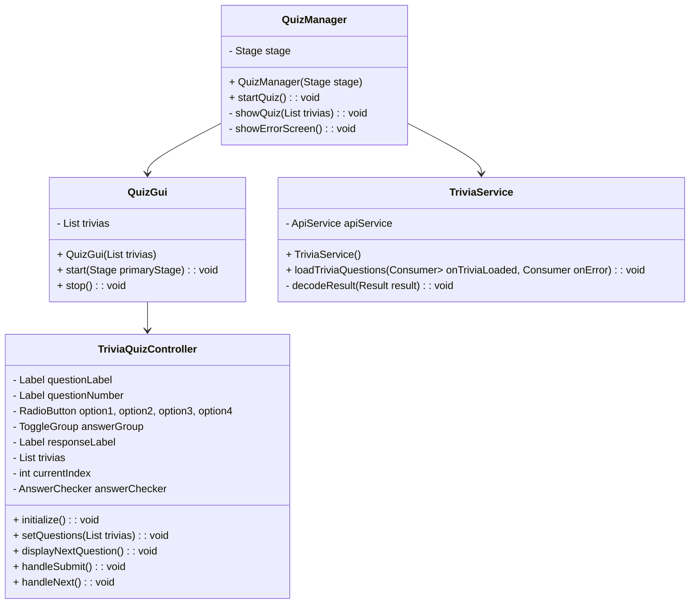

# Progetto "Progettazione e Sviluppo del Software"

## Descrizione Generale del Progetto

Il progetto prevede lo sviluppo di un software che presenta una schermata iniziale in cui l'utente può scegliere tra due opzioni:

- Avviare il gioco principale: **Signor Cervo**
- Partecipare al minigioco: **QuizTrivia**

L'utente può selezionare il gioco tramite due pulsanti presenti nella schermata principale.

## Descrizione Generale di "Signor Cervo"

"Signor Cervo" è un gioco interattivo basato su una storia a scelte multiple. Il giocatore deve prendere decisioni per proseguire, con alcune scelte che potrebbero condurre alla fine del gioco. Il gioco offre diverse funzionalità, tra cui:

- Gestione del giocatore
- Sistema di inventario
- Motore di gioco che aggiorna lo stato in tempo reale
- Funzione di salvataggio della partita
- Selezione del livello di gioco

L'architettura è suddivisa in varie classi, ognuna con specifici ruoli e responsabilità.

## Analisi del Progetto

Il progetto si basa su un gioco noto, diventato famoso su TikTok, chiamato **Signor Cervo**.

### Requisiti

1. Il software deve processare le scelte del giocatore e generare un output sulla console.
2. Il software deve aggiornare lo stato del giocatore.
3. Il software deve visualizzare immagini in base alla situazione di gioco corrente.

### Punti di Forza

- Possibilità di salvare i progressi del gioco.
- Possibilità di selezionare il livello da giocare.

Il gioco prende le scelte del giocatore come input, genera un output e prosegue la storia, che può includere oggetti da raccogliere. Ogni livello viene sbloccato solo dopo aver completato quello precedente, e i progressi possono essere salvati per essere ripresi in seguito.

### Punti Deboli

- Alcuni dati non sono persistenti e si perdono alla chiusura dell'applicazione (es: inventario del giocatore).
- Dati come il checkpoint e il livello sbloccabile possono esseere modificati se un'utente conosce JSON base.

## Utilizzo di Git e Flusso di Lavoro

Il team ha adottato un flusso di lavoro basato su Git, seguendo una struttura di branch per garantire un'organizzazione efficiente e ordinata dello sviluppo. Il flusso di lavoro segue questi passaggi:

1. Il branch principale del repository è chiamato **main**.
2. È stato creato un branch chiamato **develop**, dove vengono integrate e testate tutte le nuove funzionalità.
3. Ogni nuova funzionalità o correzione di bug viene sviluppata su un branch separato, creato a partire da **develop**.
4. Dopo che le modifiche sono state testate e validate, il branch di sviluppo viene "mergiato" su **develop**.
5. Una volta che le funzionalità presenti in **develop** sono stabili e testate, **develop** viene "mergiato" su **main**, assicurando che il branch principale contenga solo codice stabile e funzionante.

Questo approccio garantisce che lo sviluppo sia organizzato e che eventuali bug o errori vengano rilevati prima che il codice venga integrato nel branch principale.

## Design

### Architettura

Le principali entità coinvolte nel gioco sono:

1. **Main**: Classe principale che avvia il software.
2. **Player**: Rappresenta il giocatore, contenendo attributi come l'inventario (lista di oggetti) e le monete.
3. **Item**: Rappresenta gli oggetti nel gioco, ognuno con un nome, una descrizione e un valore.
4. **Game**: Il motore di gioco che gestisce l'inizializzazione, l'aggiornamento dello stato, il rendering e gli input del giocatore.
5. **MenuLevel**: Rappresenta i livelli del gioco, con metodi per caricarli e avviarli.
6. **GetResources**: Fornisce metodi per recuperare risorse dal file system.
7. **JsonReader**: Gestisce la lettura dei dati da file JSON utilizzati per il gioco.
8. **MenuMain**: Il menu principale presentato all'avvio del software.
9. **MenuSignorCervo**: Menu principale del gioco "Signor Cervo", con opzioni per iniziare una nuova partita o continuare quella in corso.
10. **MenuLevel**: Menu dove l'utente può scegliere tra i 6 livelli del gioco, se
11. **SignorCervoGUI**: L'interfaccia grafica del gioco, con pulsanti per le scelte del giocatore.
 
#### Modello UML di "Signor Cervo" 
#### Link: [UML](doc:www.plantuml.com/plantuml/png/lLbRR-is4dxth-2ZWYO1zl9K71ZDyMa35xcaSTgNnQAWfOdC7efKISg96vp_lXgHqeuzacCiWis3HN4-3eTpf_A33zA5fjApMkPVPGb2XSl6gBMzL5QypMQY_Skrz5vSomhQ6P7-BiJFtff7a0KuyGUPNgdIMBS0jxNNlov5sIX2L2O8HS6vD0QSg7RtQyfaQGAKxVnNs1sirh05JUOUjDormBfx760B9RKjBPczbVMdnFjSh89JffoBvoOq3Xx1rzPuFnlWttLdpWYdys6xCu9QMwj16c6RK3SXewIjLKKh2auZcxmgnXP6uHTMcOXg1uo9jh9O1HaW-tbrVzTg2_8WF4wSpTuxO6xD5bnuiYsLBl_3MnE7PuG5CbLvtDLlxCiDQdnXgrf3WE9AW-lF-6tFFo2qAhIDoy4JF_ckvtUZVFZqazBGAboPOi1-KGxoODqkGw8e-jTUV9ovanLCYQXRlhZIByqqAxgvRSZkKrptH3oT7HUQwMaPeA9nrAymBVp0VqrJhS5n5YJoA2EgwDxqhj4m0Ra5v3uNLVVq71K18c-S0nFY6qUbk84UrxzpvD7CG5JgaZQvZc8OFiYmcHt6HrCNCa0KqdTXf5WCEP05wWx9X1V3rQu5B3PMvS1P4GYQCgEapocWymtaNoE3kFuSxOdPZABZeIBu4Vvib3k6NbFUgusjit6X7g7MkumpY8xdSI4dZkUDKctX4Q9_38kuEzvAPSOSyHPCWpIqDBKNZREgfMTnlt_zMqXN-ZCHDiw-U87YEDVK0OeVNtEeWxBcN2plXnSk2UxOfQk309Cbe78gwNRTosJz858ElB8z25DwLq4pliTm3YelNvbAJ2fi91r5JA6yN6lut8HWJHOVOjqz61RCAT14o1t80Dq1quhaZW5UmxaW4Z738Gr3wQvBJpyvMs7SZjM4mGFUFa1h5sJbButwAsCAgDhjLaYUaeLae9CzX7SIt6y-udId-yH6caB3mfgWJ2CVsWKgo6J4wJrPv12Es5pWfcZB1UQNshRRqrOX7sRFgKAu2Vge8NQWT0SUGWT0dw5qciO7m14jO6lIwk1PkKhYcMXZGc2v1kd8cRXdzAQa3d7bdDnr9GcpvboezdUaFSLExPGwnwgLB0fadE5Fntmiqs-aHteVc0WZZT19hU5ubRpI-ihu5t1-H1s7ulF4VZnSRg5GCgcqWc7Ck8nLVCzHowfb_vk25w7w4GVzzjc-fbHt8tUs2Hpo1A_Xoe4K0LobZDGSGYyqZ1hlFsNxGunveAjim9nS9NXwfOP2gpR-AKbCC_I4PT-3yYscahywlgmpo-2P-C9TauAZvR9k5F5dftS433c4YF9VRBFMSE-M9gHLs3QFjlKqFMLJsxyu5I1MjYSRKz3GYKzaOgmi3-tEkQhbK7yPriija3p4wAN5-vaoo6q8os-piOlvPUTD-zTph8ZNZVg0IajMOfF9OST50xTLEUmBz-JKLidLG2A9jbRzj1o6DCBsbcQZkIz2Vcd0etW-MxG_JGNkKvTX8dK-5zR4uKsx18fpCS2Uy83OEY7cH-SiDtG1kItm4q6ZGnOVmdMFTonLjSlqc3A6QzFRGQlX4k5ttF7mWXItdgUzVToRCn-xNuPTFNgZUdvMUSjhnscv351QDqBvC-cQKFPkdLBhtsMiC2DihSEBT09CiL26uf0Hlpa56mVPXBso_wd-HHt_lrJuOVevmGylIRbweoUsDdpf6ZfwwgCV4aQ_831L4YTdnqG_7vl5ZfhCzvc-K326nbip9VJNLU7IW0irGDxuvvQLLWLCIyNl59GH_r91vgURoQ68CdYlldcV58xREBScEAirkB64WmLYGH1qCxa6FNXazpP9ZQMHQbmMogPBfQqHyhUZrByVfVxZAFMVXFfaorB3jRDDBM88T6E2eEbVXExf3qoUlbajJG6lXBHVhm9zc_6lkoeegTLVfrKd3YgKH--wWzVGeoY8TXghPbsfC4L53kzr3h9Mbmug6r9CeXR0FSiSQ2ccJSH2Qfsq-5z_B274AQIE9z7WxBCA2wt0X95Bn80GBWs8PXccXCGfMqiFlphzVGgRi-y7q71m7D3JN5pC3ufkXqWlaVv8qqKAQvodAsYUH1hv8ZeMOcHVSGeeYKknI4trYCnImJcLd9egOHnnO2UEefjCKVaPfpKVKGTNp1Q5DwS96hsNZIF8TxyZ038ROTsU5sm3GjXdj4_3QorRi4ofFL67EK4dEUT8nkw_5nR7E4cEDd8CZk0IiqKN9yAeKHYHYya1Ws2J2F9feEU6yyDbXb4O5uv0eN6MM9L4gs0a4loSIEtCISo874B_AyO1WtTyc_q0fcWg_Hy0)

### Design Dettagliato

#### Alessandro Agostini & Lorenzo Fini

Il team composto da Alessandro Agostini e Lorenzo Fini si è occupato della struttura e dello sviluppo del gioco "Signor Cervo". La sfida principale è stata creare una struttura in grado di gestire ciclicamente gli input del giocatore e produrre gli output corrispondenti. La soluzione è stata implementare la classe `Game`, che utilizza un file JSON per gestire le risposte, le immagini e gli oggetti di gioco.

È stata poi sviluppata la classe `JsonReader` per leggere i dati JSON. Durante i test, è emerso un problema nel recupero dei file JSON, risolto implementando la classe `GetResources`, che consente di accedere ai file di risorse indipendentemente dalla posizione del gioco.

Per la gestione dell'interfaccia grafica, è stata creata la classe `SignorCervoGUI`, che gestisce i pulsanti per le scelte dell'utente e richiama la classe `Game` per gestire la logica di gioco.

#### Modello UML (Alessandro Agostini & Lorenzo Fini)

#### Marawan Emad

Mi sono occupato della riorganizzazione del menu principale suddividendolo in tre componenti distinte: `MenuMain` che contiene il bottone per iniziare il quiz trivia e giocare a Signor Cervo, `MenuSignorCervo` e `MenuLevel`, migliorando così la chiarezza e la gestione dell’interfaccia. Ho implementato diverse funzionalità, tra cui l'avvio di una nuova partita e la continuazione di una partita salvata tramite un sistema di checkpoint. Questo sistema permette di salvare e caricare lo stato del gioco attraverso un file JSON, utilizzato per memorizzare informazioni importanti come il dialogo, gli item le monete e l'immagine corrente del gioco.

Ho sviluppato il metodo `handleContinuaPartitaButton`, che verifica l'esistenza del file di checkpoint e, se presente, utilizza il metodo loadGameFromCheckpoint per caricare lo stato salvato e riprendere la partita da dove era stata interrotta. Per avviare una nuova partita, ho implementato i metodi clearCheckpoint e resetLevelFile che svuotano il file di checkpoint con e azzerano i progressi del gioco.
Inoltre, ho creato una struttura per accedere ai livelli di gioco tramite il pulsante "Livelli del gioco", che richiama il metodo menuLevelStart, avviando così il menu dei livelli con la classe `MenuLevel`.

#### Brayan Vaccaro
## Descrizione Generale di "QuizTrivia"
Mi sono occupato di implementare il menu principale dell'applicazione, creando la classe `MenuMain`, che offre tre opzioni: avviare *SignorCervo*, avviare *QuizTrivia*, o uscire dall'applicazione. Successivamente, ho sviluppato un minigioco chiamato *QuizTrivia*, che consiste in una serie di domande a cui l'utente deve rispondere per valutare le sue conoscenze in diverse materie.

## Analisi

### Requisiti
QuizTrivia è un minigioco che ha l'obiettivo di valutare le conoscenze dell'utente su una varietà di argomenti tramite una serie di domande con risposte multiple. Il sistema deve fornire all'utente una serie di domande, mostrare le opzioni di risposta e verificare la correttezza delle risposte fornite. L'utente riceve un feedback immediato su ogni risposta, indicandogli se è corretta o meno. 

Inoltre, il sistema deve garantire un'esperienza utente fluida, con caricamenti rapidi e una navigazione semplice tra le diverse schermate del gioco, come il menu principale, il quiz stesso, e la schermata di caricamento.

#### Funzionalità principali richieste:
1. **Menu di avvio**: l'utente deve poter scegliere tra avviare *SignorCervo*, *QuizTrivia* o uscire dall'applicazione.
2. **Quiz basato su domande a risposta multipla**: il sistema deve visualizzare domande e opzioni di risposta.
3. **Verifica delle risposte**: dopo che l'utente seleziona una risposta, il sistema deve confrontarla con la risposta corretta e fornire un feedback immediato.
4. **Caricamento delle domande da una fonte esterna**: il gioco deve ottenere le domande dinamicamente da una fonte remota, un'API esterna.
5. **Gestione degli errori**: il sistema deve gestire eventuali errori durante il caricamento delle domande e garantire un'esperienza utente senza interruzioni.

### Analisi del problema
La sfida principale risiede nel garantire che il sistema sia in grado di ottenere e visualizzare correttamente domande da una fonte esterna, gestendo in modo efficiente la comunicazione con l'API e fornendo un feedback immediato e visibile all'utente. 

Un altro aspetto critico è la necessità di una gestione efficace degli errori che possono sorgere durante il caricamento delle domande, in modo che l'app non si blocchi e possa comunque offrire una buona esperienza utente.

## Design

### Architettura

L'architettura dell'applicazione segue il modello **MVC (Model-View-Controller)**, con l'aggiunta di un **Service Layer** per gestire la logica di business e le interazioni con l'API esterna. I componenti principali e le loro interazioni sono descritte di seguito.

#### Componenti principali:
- **Model**: gestisce i dati del quiz, incluse le domande e le risposte. Gli oggetti `Trivia`, `TriviaResponse` e `Result` rappresentano le entità principali.
- **View**: comprende le interfacce utente come il menu principale (`MenuMain`), l'interfaccia del quiz (`QuizGui`), la schermata di caricamento (`LoadingScreen`) e file FXML associati. Questi componenti si occupano di presentare i dati e ricevere l'input dell'utente.
- **Controller**: il controller principale (`TriviaQuizController`) gestisce la logica del quiz, riceve gli input dall'utente, interagisce con il modello per ottenere le domande e le risposte e aggiorna la vista di conseguenza.
- **Service Layer**: `TriviaService` gestisce la comunicazione con l'API esterna, recupera le domande e gestisce gli errori che potrebbero verificarsi durante il caricamento.

### Interazioni tra i componenti
1. **MenuMain**: è il punto di ingresso dell'applicazione. Fornisce all'utente le opzioni per avviare il quiz, l'altro gioco, o uscire. Quando l'utente avvia *QuizTrivia*, il manager del quiz prende il controllo.
2. **QuizManager**: mostra la schermata di caricamento (`LoadingScreen`) e carica le domande dal service layer (`TriviaService`) per passarle a `QuizGui`. Gestisce la visualizzazione di una schermata di errore in caso di fallimento nel caricamento dei quiz
3. **QuizGui**: passa al controller i trivia ricevuti e si occupa di impostare la scena e visualizzare lo stage
2. **TriviaQuizController**:  riceve le domande da (`QuizGui`) e le passa alla vista (`QuizGui`). Quando l'utente seleziona una risposta, il controller verifica la correttezza e aggiorna la vista con il feedback tramite `AnswerChecker`.
3. **TriviaService**: si occupa di inviare richieste all'API per ottenere le domande e restituirle al manager. In caso di errori, come la mancata connessione all'API, il servizio gestisce la situazione e comunica eventuali problemi al manager.

---
